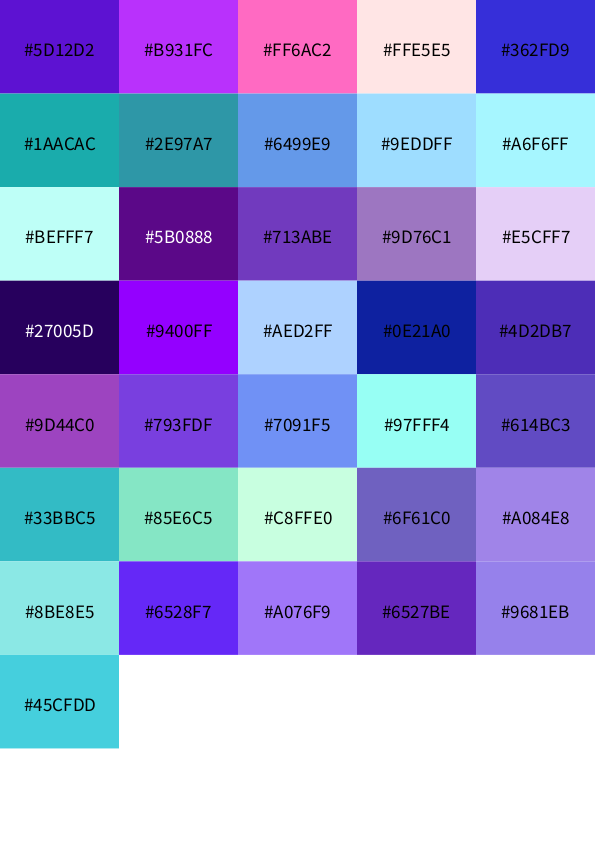

# graphisme utile

**ligne_par_ligne.sh**

Script pour transformer un texte en gif animé. Exemple avec ce texte en boule de neige :

**nuancier_001**

Script processing pour créer un nuancier pdf à partir d'un tableau de couleurs (usage ? voir concrètement comment sortent ds couleurs RVB sur une imprimante laser) 

